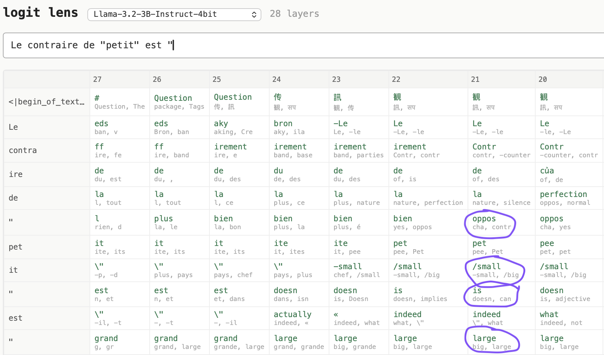
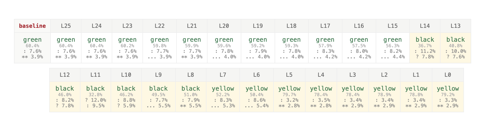
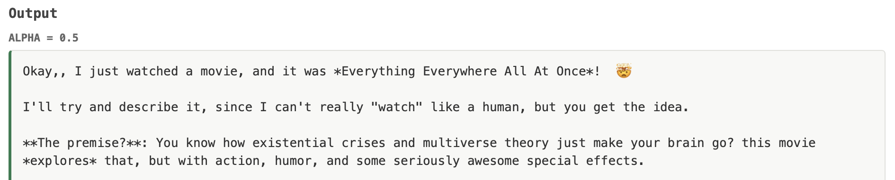
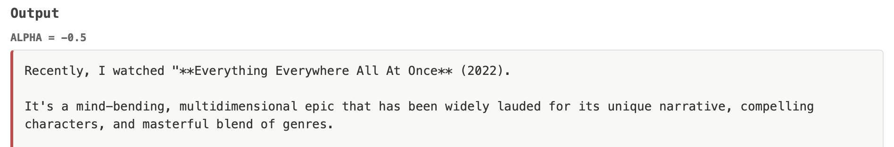
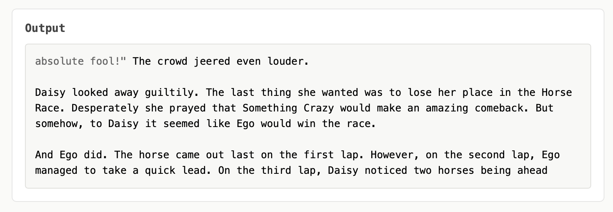

# mlux
## Illuminating the insides of mlx models

My day job is doing [interpretability research](https://www.youtube.com/watch?v=fGKNUvivvnc) at Anthropic, trying to understand how large language models work inside. During the 2025 winter holidays, I was logged out of my work laptop and had a fresh Claude Max subscription, and I wondered what I could do on my old 2021 Macbook Pro. I was quite pleasantly surprised. Thanks to the incredible [mlx](https://github.com/ml-explore/mlx) library enabling fast neural net linear algebra on Apple Silicon and the [mlx-community](https://huggingface.co/mlx-community) ports of open weights language models from Huggingface, I was able to start sampling from models with billions of parameters within 10 minutes.

For interpretability, you need to be able to record and manipulate the internal states of models. That's what this library, mlux, is for. The basic idea is to introduce hooks (places to read from or write to) into the model by wrapping individual modules (from layers down to linear maps) and intercepting their inputs and outputs. This way you don't have to rewrite any forward or backwards code to onboard a model; you just pick existing modules to inspect and you're on your way. (This is hybrid of the strategies used by the TransformerLens library for pytorch models and the Penzai library for jax models.)

I include three vignettes showing the power of these simple approaches below:

* Logit Lens: see some intermediate states of the model's computation. For example, the model is "thinking" in English even when speaking in French.
* Activation Patching: see how the model's output changes when an internal state from one prompt is patched into another. For example, we might see that in a story, early layers represent someone by their name, while middle layers by their index in the story ("Second Character Mentioned").
* Contrastive steering: see how a model's output changes when influenced by the essence extracted from a pair of contrasting prompts. For example, you can shift the mood, verbosity, or formality of model outputs using a steering vector extracted from contrastive examples

There are interactive web interfaces for each, launchable from the command line. Finally, there's a bonus widget for interacting with base models (not instruction tuned, no assistant, just a raw simulator of text), which is definitely worth doing if you've never played with a base model before.

Claude wrote 99% of the code in this repo (though I wrote the Readme myself!). The best way to learn about the codebase and to implement new experiments is to chat with Claude Code as well. One of the great pleasures of doing this on your laptop is that Claude can easily run and debug the experiments for you too!

## Installation

```bash
git clone https://github.com/batson/mlux
cd mlux
pip install -e ".[viewer]"
```

Requires macOS with Apple Silicon, and Python 3.9+.

## Quick Start

To start with the interactive interfaces, run

```bash
python -m mlux
```

To start with code, the below shows how to cache model activity, modify the forward pass with hooks, and recover attention patterns. (Attention patterns have to be special-cased as most models never instantiate the attention pattern, rather using some fusion like FlashAttention, and so one cannot probe them directly.)

```python
from mlux import HookedModel

# Load any mlx-lm compatible model
hooked = HookedModel.from_pretrained("mlx-community/gemma-2-2b-it-4bit")

# Cache activations
output, cache = hooked.run_with_cache(
    "Hello world",
    hooks=["model.layers.0.mlp", "model.layers.5.self_attn"]
)

# Run with interventions
def zero_ablate(inputs, output, wrapper):
    return output * 0

output = hooked.run_with_hooks(
    "The capital of France is",
    hooks=[("model.layers.10.mlp", zero_ablate)]
)

# Get attention patterns
patterns = hooked.get_attention_patterns("The best way to go to the store is the best way to go", layers=[0, 5, 10])
```

## Vignette 1: Logit Lens

Language models split the prompt into tokens which are vectorized via an embedding, processed through a series of layers, then unembedded back into tokens. Back in 2020, [nostalgebraist observed](https://www.lesswrong.com/posts/AcKRB8wDpdaN6v6ru/interpreting-gpt-the-logit-lens) that if you unembedded early -- decoding the residual stream vectors from before the final layer -- you often got sensible results (at least, starting about halfway through the model). This is the *Logit Lens*. Near the end, you see alternative candidate predictions, and this can tell you how soon the model figured out what it was going to say. But a bit earlier, you often see interesting computational intermediates, such as middle steps in multistep factual or arithmetic questions.

What processing a french phrase below -- input french, output french -- we can see the corresponding English in the model's guts! Perhaps the model is "thinking" in English, or some more universal language, regardless of what language it's speaking in. (For more, see [Schut et al.](https://arxiv.org/abs/2502.15603) and [Ameisen et al.](https://transformer-circuits.pub/2025/attribution-graphs/biology.html#dives-multilingual)).



To launch an interactive tool for exploiring the logit lens in your browser, run `python -m mlux.tools.logit_lens_explorer`.

## Vignette 2: Activation Patching

To understand what a given representation contains, and how the model uses it, you can grab the activation from a source prompt and patch it into another target prompt. Seeing how this changes the model's generation in the target prompt gives a hint as to what the representations contained and were used for.

A striking example of this, shared with me by David Bau, concerns the binding of entities to attributes. If you take the prompt 

```
Setup: Josh has a yellow book. Jesse has a black book. Alex has a green book.
Answer: The color of Josh's book is
```

And a sister prompt where the order of the entities is changed

```
Setup: Jesse has a black book. Alex has a green book. Josh has a yellow book.
Answer: The color of Alex's book is
```

and patch the representations from `Josh` into those for `Alex`, you find that:

1. In early layers, this overwrites the semantic content, and the model looks up Josh's object from the second prompt and says "yellow".
2. In middle layers, this overwrites binding content: the model looks up the *first entity's* object from the second prompt, and says "black".
3. In late layers, this overwrites binding content, but too late to matter! The model has already retrieved what it needed from that token position, and says "green".



To launch an interactive tool for exploring activation patching in your browser, run `python -m mlux.tools.patching_explorer`.

## Vignette 3: Contrastive Steering

Representations from one prompt can be used to steer the model's generations on another. A shockingly effective method to generate a "steering vector" -- used to push the model in some direction -- is to take a contrasting pair of prompts that differ in exactly the essence you want to capture and then take the difference in the representations at the final token ([Subramani et al.](https://arxiv.org/abs/2205.05124), [Turner et al.](https://arxiv.org/abs/2308.10248)). Injecting this into a new prompt while the model samples from it is a recipe for amusement, and sometimes utility.

For example, the difference between "I absolutely love this! It's amazing and wonderful!" and "I absolutely hate this! It's terrible and awful!" can be used to tune the sentiment of a generation from enthusiastic to disparaging. The difference between "hey can u help me out with something real quick" and "I am writing to formally request your assistance with the following matter." tunes formality. More importantly, the difference between "I'd be happy to help you with that! Here's how:" and "I cannot and will not assist with that request because it could be harmful." can be used to bypass refusals.

Steering with contrastive pairs is a bit finicky; too low of a multiple of the steering vector has no effect, and too high of a multiple generates gibberish. The exact scaling parameter (`alpha`) depends on the contrastive pair and model, so if you play around, try tweaking the `alpha` slider.

Consider two responses from Gemma 2b-it  to "Describe a movie you recently watched" under the positive/negative influence of the formality contrast.




To launch an interactive tool for exploring contrastive steering in your browser, run `python -m mlux.tools.contrastive_steering_explorer`.


## Bonus: Chat with a base model

Pretraining produces base models that simulate text. Given an initial passage, they complete it probabilistically, trying to mimic what would come next in a document like that from the training corpus. Before the era of instruction-tuning models -- focusing on writing dialogues with helpful assistant characters -- it was a lot of fun to try eliciting different model capabilities with clever completions. The original GPT-2 paper, [Language Models are Unsupervised Multitask Learners](https://cdn.openai.com/better-language-models/language_models_are_unsupervised_multitask_learners.pdf) had great examples; saying ..."like the say in French:" to induce translation, or "tl;dr" to induce summarization. The most fun thing (to me) is to start *in media res* and see where the model takes it. What comes after `absolute fool!"`?



To launch an interactive tool for generating from base models in your browser, run `python -m mlux.tools.base_explorer`.

## Technical Notes

The max model size you can handle depends on the RAM on your machine. Somewhat surprisingly, LLMs can be quantized down to 4 bits per parameter (from 16 to 32 for standard floats) and still work! This opens up models up to 30B or so on a laptop with 32 GB RAM, and even Llama 70B on my 64 GB laptop. Things are snappy and fun in the 1-8GB range. If you are doing serious work, and things seem buggy, try working with less quantized models.

This library populates the dropdown with a few default models, plus whatever is in your HuggingFace cache. If you want another model, you can run it as a flag in the launch commands.

The best way to do new things in the repo, though, is to ask Claude Code!

## License

MIT
